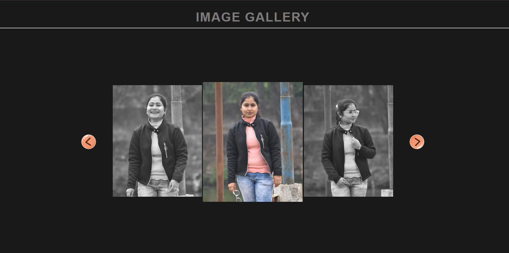

# Image Gallery

A responsive image gallery with smooth horizontal scrolling and navigation buttons.

### Live Demo :



## Features

- Horizontal scrolling gallery
- Navigation buttons (next/previous)
- Smooth scroll behavior
- Wheel/trackpad support for scrolling
- Responsive design

## Technologies Used

- HTML5
- CSS3
- JavaScript (Vanilla JS)

## File Structure

image-gallery/
├── index.html
├── style.css
├── script.js
├── README.md
└── images/
├── back.png
├── next.png
├── image-1.JPG
├── image-2.JPG
├── image-3.JPG
├── image-4.JPG
├── image-5.JPG
└── image-6.JPG

## Installation & Usage

1. Clone the repository or download the ZIP file

   ```bash
   git clone https://github.com/iamarpisaha/image-gallery.git

   ```

2. Open `index.html` in your browser

## How It Works

1. Navigation:

- Click the arrow buttons to scroll left/right
- Use mouse wheel/trackpad for horizontal scrolling

2. Smooth Scrolling:

- Button clicks trigger smooth scrolling
- Wheel scrolling is instant

## Customization

1. To add more images:

- Add image files to the images folder
- Add new <span></span> elements to the gallery divs

2. To adjust scrolling behavior:

- Modify the scroll amount (900px) in script.js:
  scrollContainer.scrollLeft += 900; // Change this value

## Browser Support

Works on all modern browsers including:

- Chrome
- Firefox
- Safari
- Edge

## License

This project is open source and available under the MIT License.
